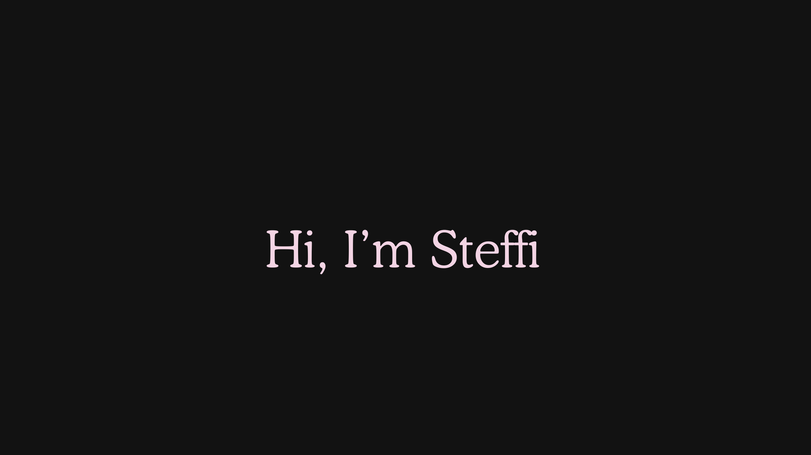

<!-- BANNER -->

# Hi, I'm a Student 👋

> Beginner developer learning programming one step at a time.

---

## 🧠 About Me

- 🎓 Student
- 💻 New to programming
- 🌱 Currently learning the basics
- 🔧 Building small projects to improve

---

## 🚀 Tech I'm learning

---

## 📊 GitHub Stats

---

## 💭 Quote

> “Learning to code is learning to think.”

---

## 📫 Contact

- GitHub: github.com/DITT_USERNAME

- <text fill="#f3d4e4">Hello</text>

