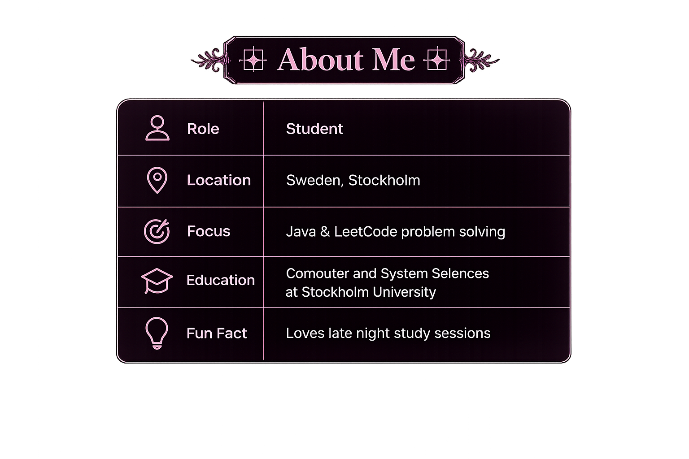

  
<!-- ─── BANNER ─────────────────────────────────────────── -->

---

<!-- ─── TYPING TAGLINE ────────────────────────────────────────── -->

<!-- ─── ABOUT ME ───────────────────────────────────────────────── -->

  

---
<!-- ─── GITHUB STATS ROW ──────────────────────────────────────── -->

